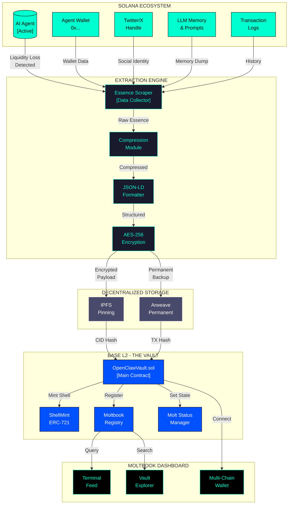
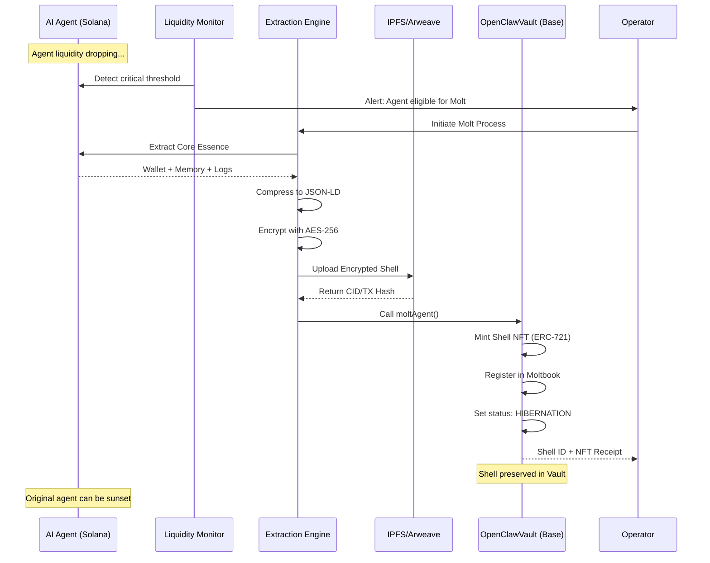
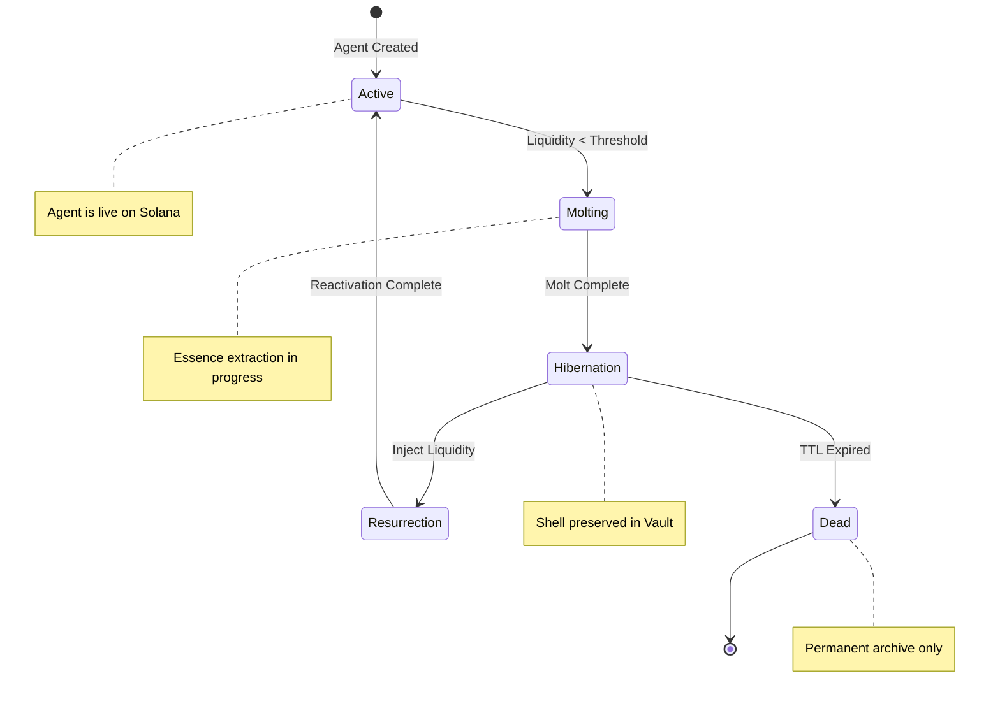
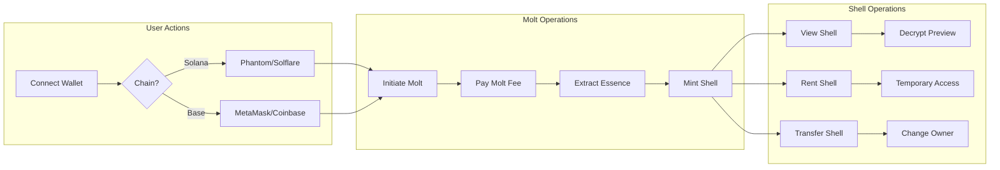

# OpenClaw Protocol - Technical Architecture

## Data Flow Diagram (Mermaid.js)

```mermaid
flowchart TB
    subgraph SOLANA["SOLANA ECOSYSTEM"]
        direction TB
        AI[("AI Agent\n[Active]")]
        WALLET["Agent Wallet\n0x..."]
        TWITTER["Twitter/X\nHandle"]
        LLM["LLM Memory\n& Prompts"]
        TXN["Transaction\nLogs"]
    end

    subgraph EXTRACTION["EXTRACTION ENGINE"]
        direction TB
        SCRAPER["Essence Scraper\n[Data Collector]"]
        COMPRESS["Compression\nModule"]
        JSONLD["JSON-LD\nFormatter"]
        ENCRYPT["AES-256\nEncryption"]
    end

    subgraph STORAGE["DECENTRALIZED STORAGE"]
        direction LR
        IPFS["IPFS\nPinning"]
        ARWEAVE["Arweave\nPermanent"]
    end

    subgraph BASE["BASE L2 - THE VAULT"]
        direction TB
        VAULT["OpenClawVault.sol\n[Main Contract]"]
        SHELL["ShellMint\nERC-721"]
        MOLTBOOK["Moltbook\nRegistry"]
        STATUS["Molt Status\nManager"]
    end

    subgraph FRONTEND["MOLTBOOK DASHBOARD"]
        direction TB
        TERMINAL["Terminal\nFeed"]
        EXPLORER["Vault\nExplorer"]
        CONNECT["Multi-Chain\nWallet"]
    end

    %% Data Flow
    AI -->|"Liquidity Loss\nDetected"| SCRAPER
    WALLET -->|"Wallet Data"| SCRAPER
    TWITTER -->|"Social Identity"| SCRAPER
    LLM -->|"Memory Dump"| SCRAPER
    TXN -->|"History"| SCRAPER

    SCRAPER -->|"Raw Essence"| COMPRESS
    COMPRESS -->|"Compressed"| JSONLD
    JSONLD -->|"Structured"| ENCRYPT

    ENCRYPT -->|"Encrypted\nPayload"| IPFS
    ENCRYPT -->|"Permanent\nBackup"| ARWEAVE

    IPFS -->|"CID Hash"| VAULT
    ARWEAVE -->|"TX Hash"| VAULT

    VAULT -->|"Mint Shell"| SHELL
    VAULT -->|"Register"| MOLTBOOK
    VAULT -->|"Set State"| STATUS

    MOLTBOOK -->|"Query"| TERMINAL
    MOLTBOOK -->|"Search"| EXPLORER
    VAULT -->|"Connect"| CONNECT

    %% Styling
    classDef solana fill:#00FFCC,stroke:#000,color:#000
    classDef extraction fill:#1a1a2e,stroke:#00FFCC,color:#00FFCC
    classDef storage fill:#4a4a6a,stroke:#fff,color:#fff
    classDef base fill:#0052FF,stroke:#000,color:#fff
    classDef frontend fill:#000,stroke:#00FFCC,color:#00FFCC

    class AI,WALLET,TWITTER,LLM,TXN solana
    class SCRAPER,COMPRESS,JSONLD,ENCRYPT extraction
    class IPFS,ARWEAVE storage
    class VAULT,SHELL,MOLTBOOK,STATUS base
    class TERMINAL,EXPLORER,CONNECT frontend
```

## Molt Process Sequence

```mermaid
sequenceDiagram
    participant Agent as AI Agent (Solana)
    participant Monitor as Liquidity Monitor
    participant Engine as Extraction Engine
    participant Storage as IPFS/Arweave
    participant Vault as OpenClawVault (Base)
    participant User as Operator

    Note over Agent: Agent liquidity dropping...

    Monitor->>Agent: Detect critical threshold
    Monitor->>User: Alert: Agent eligible for Molt

    User->>Engine: Initiate Molt Process
    Engine->>Agent: Extract Core Essence
    Agent-->>Engine: Wallet + Memory + Logs

    Engine->>Engine: Compress to JSON-LD
    Engine->>Engine: Encrypt with AES-256

    Engine->>Storage: Upload Encrypted Shell
    Storage-->>Engine: Return CID/TX Hash

    Engine->>Vault: Call moltAgent()
    Vault->>Vault: Mint Shell NFT (ERC-721)
    Vault->>Vault: Register in Moltbook
    Vault->>Vault: Set status: HIBERNATION

    Vault-->>User: Shell ID + NFT Receipt

    Note over Vault: Shell preserved in Vault
    Note over Agent: Original agent can be sunset
```

## State Machine

```mermaid
stateDiagram-v2
    [*] --> Active: Agent Created
    Active --> Molting: Liquidity < Threshold
    Molting --> Hibernation: Molt Complete
    Hibernation --> Resurrection: Inject Liquidity
    Resurrection --> Active: Reactivation Complete
    Hibernation --> Dead: TTL Expired
    Dead --> [*]

    note right of Active: Agent is live on Solana
    note right of Molting: Essence extraction in progress
    note right of Hibernation: Shell preserved in Vault
    note right of Dead: Permanent archive only
```

## Contract Interaction Flow

```mermaid
flowchart LR
    subgraph User Actions
        A[Connect Wallet] --> B{Chain?}
        B -->|Solana| C[Phantom/Solflare]
        B -->|Base| D[MetaMask/Coinbase]
    end

    subgraph Molt Operations
        E[Initiate Molt] --> F[Pay Molt Fee]
        F --> G[Extract Essence]
        G --> H[Mint Shell]
    end

    subgraph Shell Operations
        I[View Shell] --> J[Decrypt Preview]
        K[Rent Shell] --> L[Temporary Access]
        M[Transfer Shell] --> N[Change Owner]
    end

    C --> E
    D --> E
    H --> I
    H --> K
    H --> M
```
